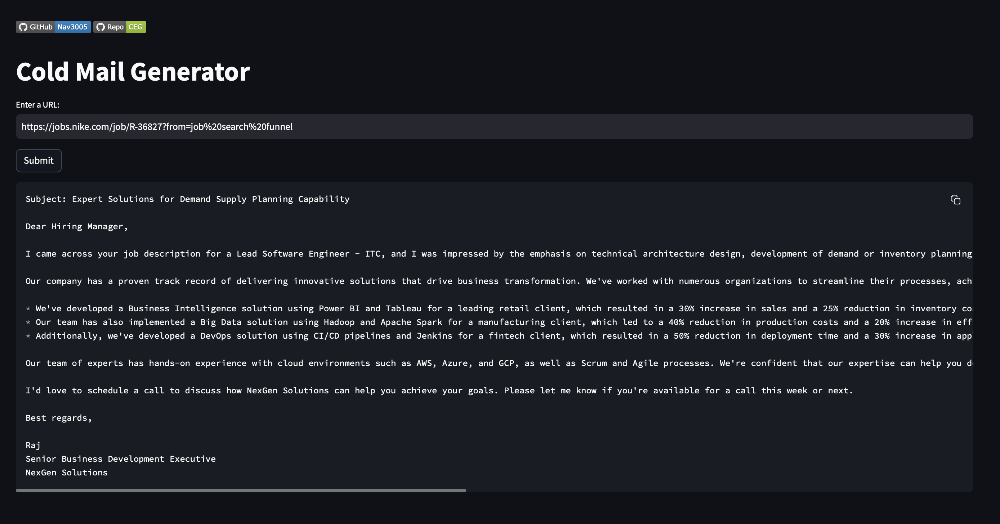
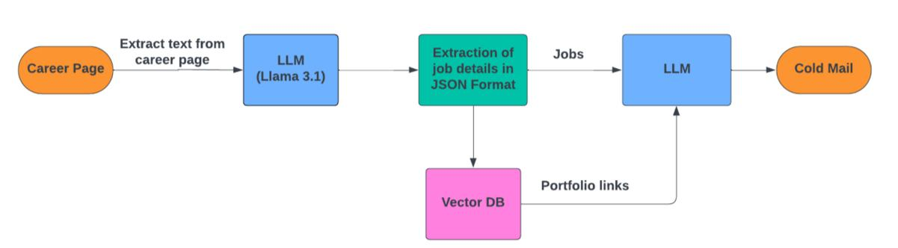

# Cold Email Generator
Welcome to the Cold Email Generator project! This application helps automate the process of generating cold emails using advanced language models, providing personalized content that resonates with potential clients.


## Overview
The Cold Email Generator leverages LLM to create personalized cold emails with ease. By integrating Llama 3.1, Langchain, Groq and other powerful tools, this project offers a streamlined interface for generating customized emails based on user input and predefined templates.

## Features
- **Automated Email Generation**: Generate cold emails using AI.
- **Customizable Templates**: Tailor the email content to match specific industries or business needs.
- **User-friendly Interface**: Built with Streamlit for an intuitive user experience.
- **API Integration**: Uses Groq API for enhanced language processing.

## Technologies Used
- **Llama 3.1 (LLM)**: Large language model for generating human-like email content.
- **Langchain**: A framework for developing applications powered by language models.
- **Groq API**: Integrates Groq's powerful API to enhance language model capabilities.
- **ChromaDB**: Store vector embeddings for fast retrieval.
- **Jupyter Notebook**: Used for prototyping and experimenting with different AI models.
- **Streamlit**: Web application framework for creating a simple and interactive user interface.

## Architecture Model


## Installation
To get started with this project, follow these steps:

1. **Clone the repository**:
   ```bash
   git clone https://github.com/<username>/<repo>.git
   cd <repo>

2. **Create a virtual environment** (optional but recommended):
   ```bash
   python -m venv venv

3. **Activate the virtual environment**:
   - On macOS/Linux:
     ```bash
     source venv/bin/activate
     ```
   - On Windows:
     ```bash
     venv\Scripts\activate
     ```
     
4. **Set up the Groq API key**:
   - Obtain your API key from [Groq](https://console.groq.com/docs/quickstart) and set it as an environment variable:
     ```bash
     export GROQ_API_KEY=your_api_key
     ```
5. **Run the Streamlit app**:
   ```bash
   streamlit run app.py

## References:
- [ChatGroq](https://python.langchain.com/v0.2/docs/integrations/chat/groq/)
- [Vector Database](https://www.qwak.com/post/utilizing-llms-with-embedding-stores#:~:text=Vector%20embeddings%20are%20essential%20in,in%20a%20high%2Ddimensional%20space.)
- [LLM Embedding](https://pub.aimind.so/llm-embeddings-explained-simply-f7536d3d0e4b)
- [Python Environment](https://pypi.org/project/python-dotenv/)
